# Film ve Dizi Öneri Platformu — Proje Raporu

**Proje Adı:** Film ve Dizi Öneri Platformu   
**Ekip Üyeleri:** 
Furkan Demirci - 231307061
Yekta Cengiz - 231307080
**Tarih:** 3 Nisan 2026  
**Ders:** Yazılım Laboratuvarı II 

---

## 1. Giriş

### Problemin Tanımı
Dijital içerik platformlarında film ve dizi sayısının hızla artması, kullanıcıların ilgi alanlarına uygun içerik bulmasını zorlaştırmaktadır. Geleneksel monolitik mimariler artan kullanıcı talebi ve veri hacmi karşısında ölçeklenebilirlik, bağımsız dağıtım ve bakım güçlükleri yaşamaktadır.

### Amaç
Bu projenin amacı; kullanıcıların film/dizi araması yapabildiği, yorum ve puanlama bırakabildiği, JWT tabanlı kimlik doğrulama ile güvenli bir şekilde erişim sağlayabildiği, **mikroservis mimarisi** üzerine kurulu ölçeklenebilir bir platform geliştirmektir. Proje; Docker ile konteynerleştirme, her servise ayrı NoSQL veritabanı, merkezi API Gateway, Prometheus/Grafana ile izleme ve Locust ile yük testi bileşenlerini içermektedir.

---

## 2. Sistem Tasarımı ve Mikroservisler

### 2.1 RESTful Servisler

REST (Representational State Transfer), istemci-sunucu arasındaki iletişimi durumsuz (stateless) HTTP istekleri üzerinden gerçekleştiren bir mimari stildir. Her kaynak benzersiz bir URI ile tanımlanır ve standart HTTP metodları (GET, POST, PUT, DELETE) kullanılarak işlem yapılır. Bu projede tüm servisler RESTful prensiplere uygun şekilde tasarlanmıştır:

| Servis | Metod | Endpoint | Açıklama |
|---|---|---|---|
| Auth Service | POST | `/auth/register` | Yeni kullanıcı kaydı |
| Auth Service | POST | `/auth/login` | Kullanıcı girişi, JWT token üretimi |
| Content Service | GET | `/api/films` | Tüm filmleri listeleme |
| Content Service | GET | `/api/films/{id}` | Tek film detayı |
| Content Service | GET | `/api/films/{id}/details` | Film + yorumları birlikte getirme |
| Content Service | POST | `/api/films` | Yeni film ekleme |
| Content Service | DELETE | `/api/films/{id}` | Film silme |
| Review Service | GET | `/api/reviews` | Tüm yorumları listeleme |
| Review Service | POST | `/api/reviews` | Yeni yorum ekleme |
| Review Service | GET | `/api/reviews/film/{filmId}` | Bir filme ait yorumları getirme |

### 2.2 Richardson Olgunluk Modeli (Richardson Maturity Model)

Richardson Olgunluk Modeli, bir API'nin RESTful olgunluk seviyesini dört kademede değerlendirir:

| Seviye | Tanım | Projede Uygulama |
|---|---|---|
| **Seviye 0 – The Swamp of POX** | Tek bir URI, tek bir HTTP metodu (genellikle POST). | Projede bu seviye aşılmıştır. |
| **Seviye 1 – Resources** | Her kaynak kendi URI'sine sahiptir. | `/api/films`, `/api/reviews`, `/auth` gibi kaynak bazlı ayrım yapılmıştır. |
| **Seviye 2 – HTTP Verbs** | HTTP metodları anlamlarına uygun kullanılır. | `GET` veri okuma, `POST` veri oluşturma, `DELETE` veri silme için kullanılmaktadır. Yanıtlarda uygun durum kodları (200, 201, 401, 403, 404, 503) döndürülmektedir. |
| **Seviye 3 – HATEOAS** | Yanıtlarda ilgili kaynaklara hypermedia bağlantıları sunulur. | Bu seviye mevcut projede uygulanmamıştır. |

**Sonuç:** Proje **Seviye 2** olgunluğundadır.

### 2.3 Sınıf Yapıları

Her mikroservis katmanlı mimari (Layered Architecture) ile yapılandırılmıştır:

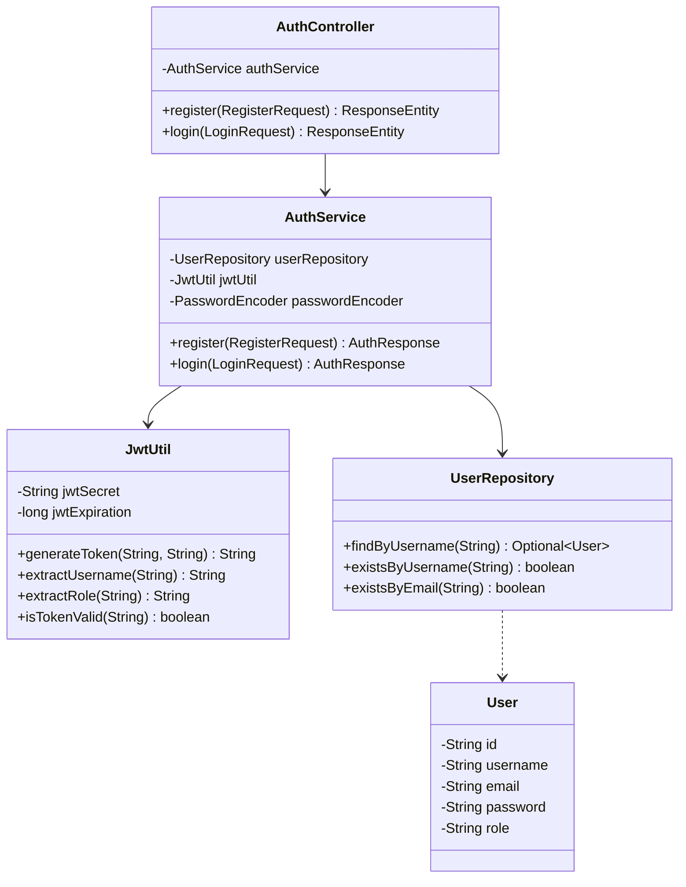

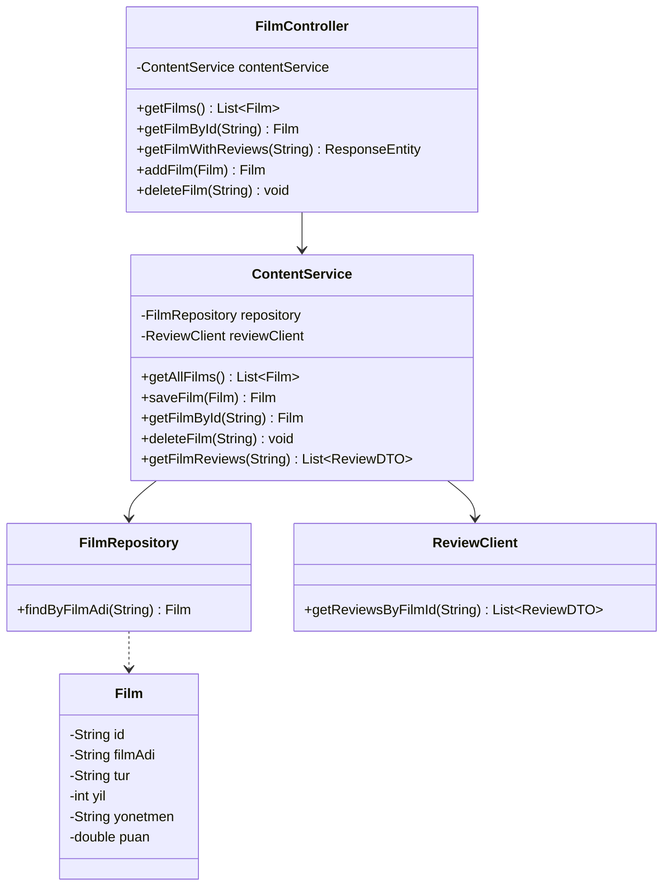

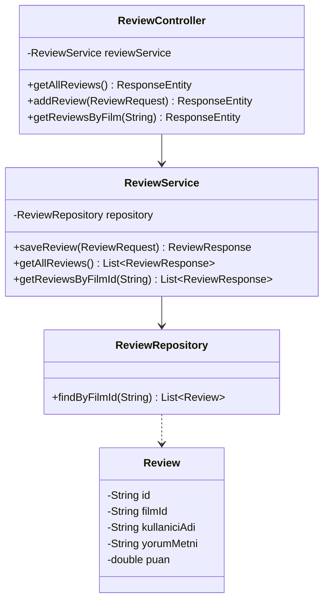

### 2.4 Sequence Diyagramları

#### Kullanıcı Kayıt Akışı

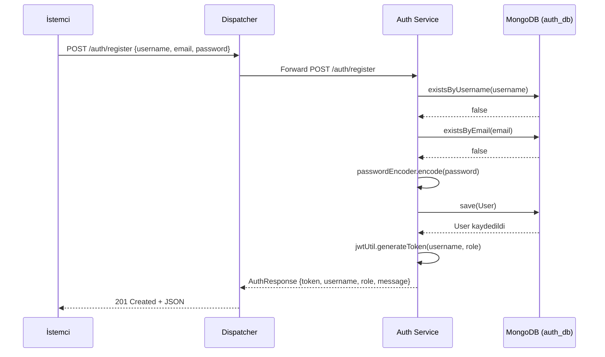

#### Film Listeleme Akışı

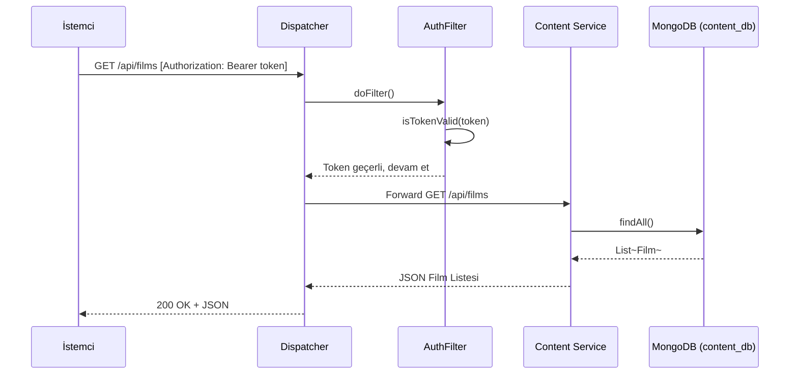

#### Film Detay + Yorumlar Akışı (Servisler Arası İletişim)

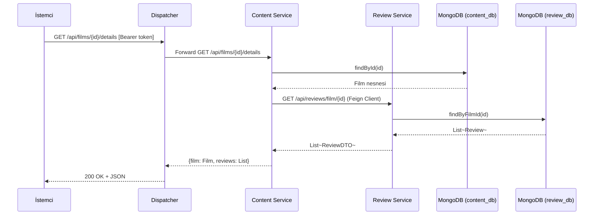

#### Yorum Ekleme Akışı

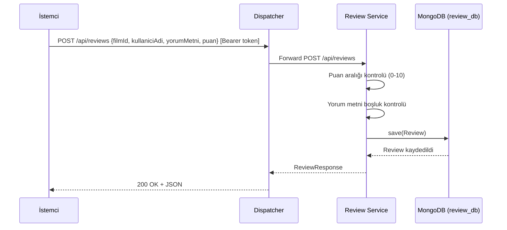

### 2.5 Dispatcher (API Gateway) Akış Diyagramı

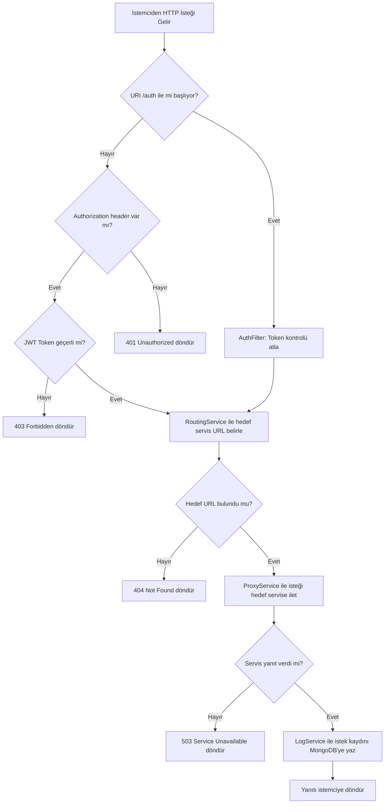

### 2.6 Algoritmalar ve Karmaşıklık Analizi

| İşlem | Algoritma | Zaman Karmaşıklığı | Açıklama |
|---|---|---|---|
| Film Listeleme | `findAll()` | O(n) | Tüm kayıtlar taranır (n = film sayısı). |
| Film ID ile Getirme | `findById(id)` | O(log n) | MongoDB `_id` indeksi üzerinden B-Tree araması. |
| Film Adı ile Arama | `findByFilmAdi(name)` | O(log n) | İndeks varsa logaritmik, yoksa O(n). |
| Yorum Ekleme | `save(review)` | O(log n) | İndeksli koleksiyona ekleme. |
| Filme Göre Yorum Getirme | `findByFilmId(filmId)` | O(log n + k) | İndeks araması + k adet sonuç döndürme. |
| Kullanıcı Adı Kontrolü | `existsByUsername(name)` | O(log n) | Unique indeks üzerinden arama. |
| JWT Token Üretimi | HMAC-SHA256 | O(1) | Sabit uzunlukta hash hesaplaması. |
| JWT Token Doğrulama | HMAC-SHA256 + Parse | O(1) | Sabit uzunlukta imza doğrulama. |
| Şifre Hashleme | BCrypt | O(1)* | Sabit sayıda round ile hesaplama (*yapılandırılabilir). |
| Rota Çözümleme | `startsWith()` karşılaştırma | O(m) | m = rota kuralı sayısı (3 sabit kural). |

### 2.7 Literatür İncelemesi

- **Mikroservis Mimarisi:** Martin Fowler ve James Lewis (2014) tarafından tanımlanan, uygulamayı küçük, bağımsız çalışan ve dağıtılabilen servisler bütünü olarak yapılandırma yaklaşımıdır. Her servis tek bir iş sürecine odaklanır ve kendi veri deposuna sahiptir (Database-per-Service pattern).
- **REST (Representational State Transfer):** Roy Fielding'in 2000 yılındaki doktora tezinde tanımladığı, HTTP protokolü üzerinden durumsuz (stateless) iletişim sağlayan mimari stildir.
- **Richardson Maturity Model:** Leonard Richardson tarafından önerilen, bir API'nin REST uyumluluğunu dört seviyede değerlendiren modeldir. Seviye 0'dan Seviye 3'e (HATEOAS) doğru olgunluk artar.
- **JWT (JSON Web Token):** RFC 7519 standardına dayanan, taraflar arasında güvenli bilgi aktarımı için kullanılan kompakt ve kendi kendini doğrulayabilen token yapısıdır.
- **API Gateway Pattern:** Tüm istemci isteklerini tek bir giriş noktasından karşılayarak mikroservislere yönlendiren tasarım kalıbıdır. Bu projede Dispatcher servisi bu görevi üstlenmektedir.

---

## 3. Proje Yapısı ve Modüller

### 3.1 Sistem Mimarisi

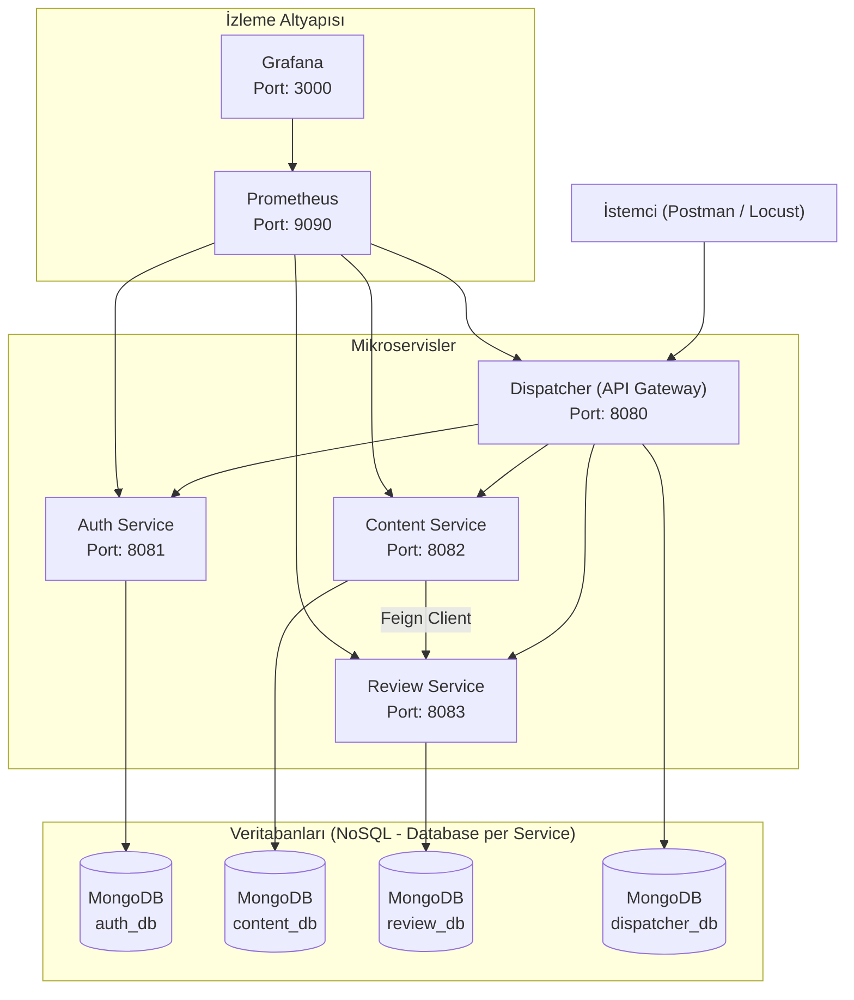

### 3.2 Dizin Yapısı

```
FilmDiziOneriPlatform/
├── dispatcher/                    # API Gateway servisi
│   └── src/main/java/.../dispatcher/
│       ├── DispatcherController.java   # Tüm istekleri karşılayan ana controller
│       ├── filter/AuthFilter.java      # JWT token doğrulama filtresi
│       ├── routing/RoutingService.java # URI bazlı servis yönlendirme
│       ├── proxy/ProxyService.java     # RestTemplate ile istek iletme
│       ├── logging/LogEntry.java       # İstek log modeli
│       ├── logging/LogService.java     # MongoDB'ye log kaydetme
│       └── exception/GlobalExceptionHandler.java
│
├── auth-service/                  # Kimlik doğrulama servisi
│   └── src/main/java/.../auth/
│       ├── controller/AuthController.java
│       ├── service/AuthService.java
│       ├── security/JwtUtil.java
│       ├── config/SecurityConfig.java
│       ├── model/User.java
│       ├── repository/UserRepository.java
│       └── dto/ (RegisterRequest, LoginRequest, AuthResponse)
│
├── content-service/               # Film içerik yönetimi servisi
│   └── src/main/java/.../contentservice/
│       ├── controller/FilmController.java
│       ├── service/ContentService.java
│       ├── client/ReviewClient.java    # Feign Client (Review Service'e istek)
│       ├── model/Film.java
│       ├── repository/FilmRepository.java
│       └── dto/ (FilmRequest, FilmResponse, ReviewDTO)
│
├── review-service/                # Yorum ve puanlama servisi
│   └── src/main/java/.../reviewservice/
│       ├── controller/ReviewController.java
│       ├── service/ReviewService.java
│       ├── model/Review.java
│       ├── repository/ReviewRepository.java
│       └── dto/ (ReviewRequest, ReviewResponse)
│
├── monitoring/
│   ├── prometheus.yml             # Prometheus scrape yapılandırması
│   └── grafana/                   # Grafana dashboard ve provisioning
│
├── docker-compose.yml             # Tüm servislerin orkestrasyon dosyası
└── locustfile.py                  # Yük testi senaryoları
```

### 3.3 Modül İşlevleri

| Modül | Teknoloji | İşlev |
|---|---|---|
| **Dispatcher** | Spring Boot, RestTemplate | Tüm istekleri karşılar, JWT doğrulama yapar, URI'ye göre hedef servise yönlendirir, istek loglarını MongoDB'ye kaydeder. |
| **Auth Service** | Spring Boot, Spring Security, JWT | Kullanıcı kayıt (`register`) ve giriş (`login`) işlemlerini yönetir. Şifreleri BCrypt ile hashler, JWT token üretir. |
| **Content Service** | Spring Boot, OpenFeign | Film verilerinin CRUD işlemlerini yönetir. Film detay sorgusunda Feign Client ile Review Service'ten yorumları çeker. |
| **Review Service** | Spring Boot | Kullanıcı yorumlarını ve puanlamalarını yönetir. Puan aralığı (0–10) ve boş yorum kontrolü yapar. |
| **MongoDB (×4)** | MongoDB 7.0 | Her servis için izole veritabanı: `auth_db`, `content_db`, `review_db`, `dispatcher_db`. |
| **Prometheus** | Prometheus | Tüm servislerin `/actuator/prometheus` endpointlerinden 15 saniyelik aralıklarla metrik toplar. |
| **Grafana** | Grafana | Prometheus verilerini görselleştirir; JVM bellek, HTTP istek sayıları, yanıt süreleri gibi metrikleri dashboard üzerinde sunar. |
| **Locust** | Python (Locust) | Sanal kullanıcılarla otomatik yük testi yapar: kayıt → giriş → film ekleme → yorum yazma → detay sorgulama senaryolarını çalıştırır. |

### 3.4 Docker Konteyner Yapısı

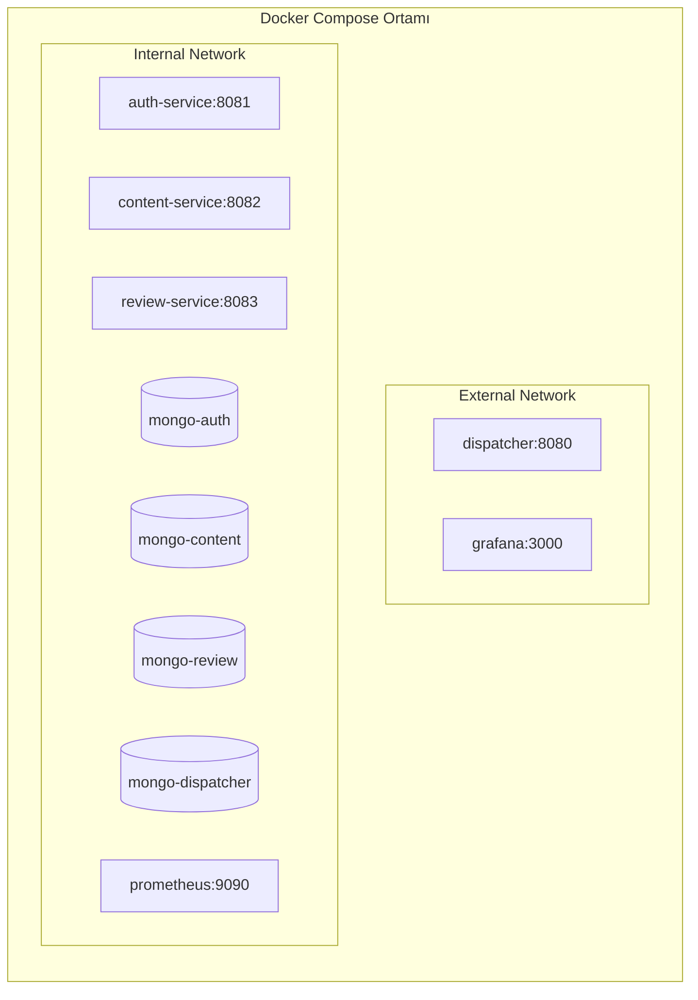

---

## 4. Uygulama, Ekran Görüntüleri ve Test Sonuçları

### 4.1 Ekran Görüntüleri

- **Kullanıcı Kayıt İsteği (POST /auth/register):**  
  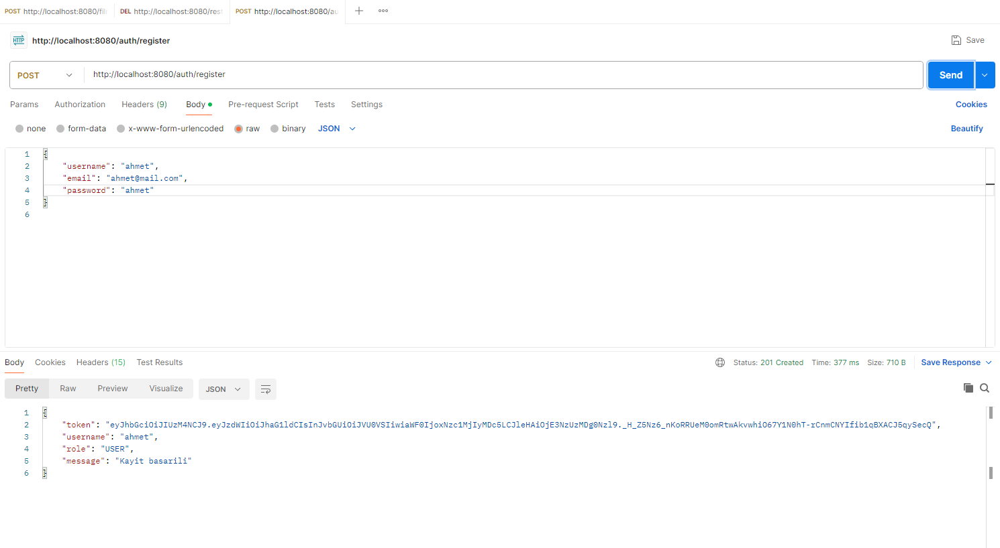

- **Kullanıcı Giriş ve Token Alma (POST /auth/login):**  
  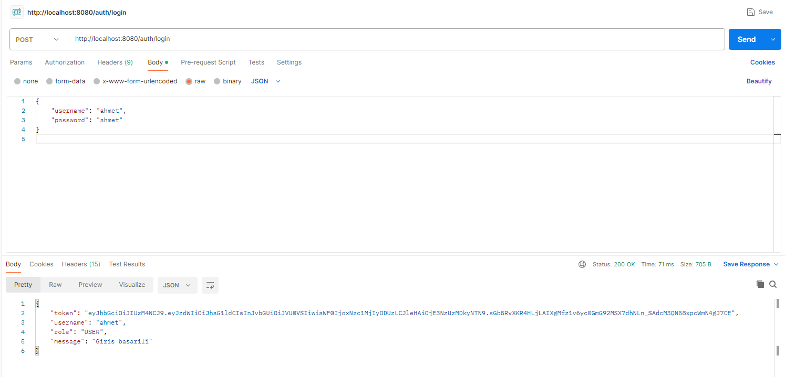

- **Film Listeleme (GET /api/films):**  
  

- **Film Ekleme (POST /api/films):**  
  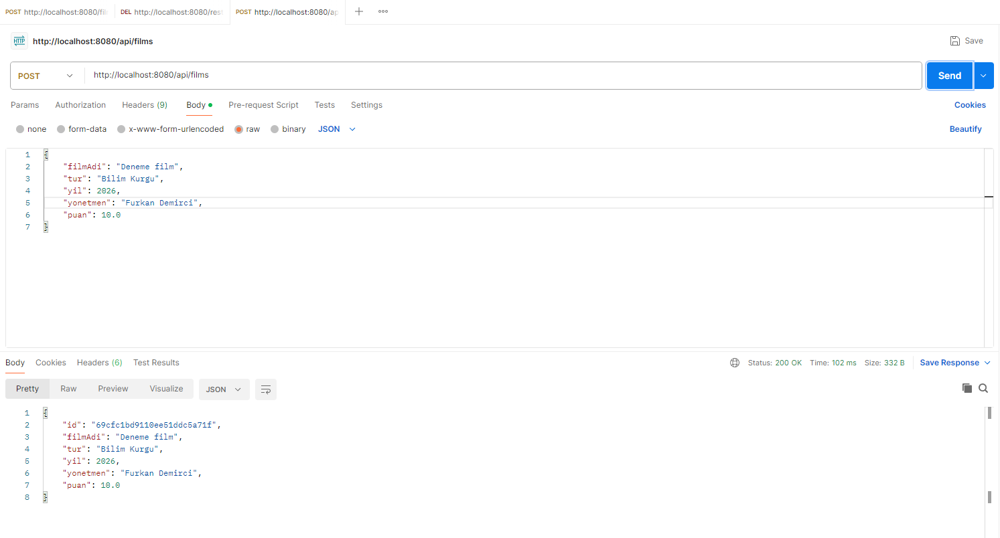

- **Film Detay + Yorumlar (GET /api/films/{id}/details):**  
  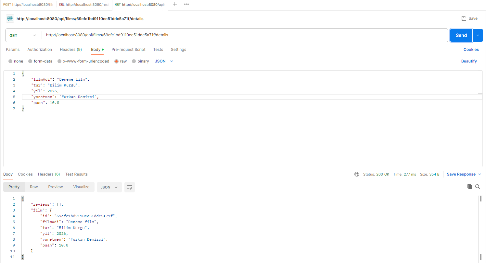

- **Yorum Ekleme (POST /api/reviews):**  
  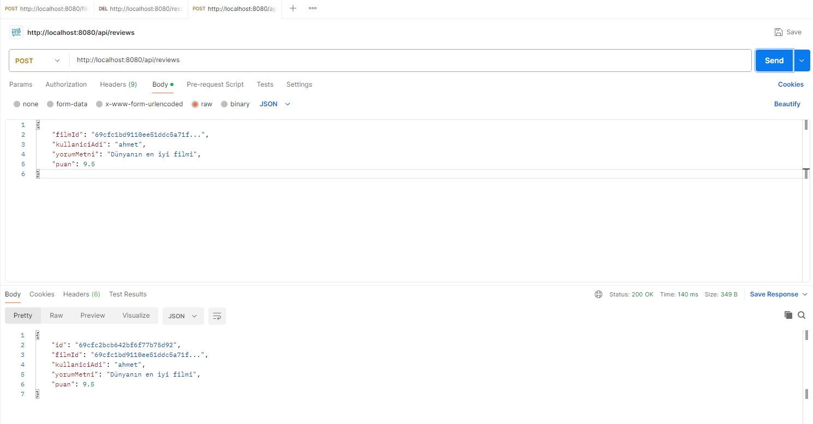

- **Grafana Dashboard:**  
  `[EKRAN GÖRÜNTÜSÜ EKLE — Servis metrikleri gösterimi]`

- **Locust Yük Testi Sonuçları:**  
  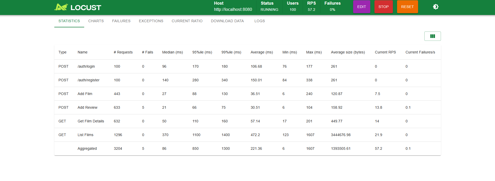

### 4.2 Test Senaryoları

#### Birim Testleri (Unit Tests)

Dispatcher servisinde JUnit 5 ve Mockito kullanılarak TDD yaklaşımıyla birim testleri yazılmıştır:

| Test Sınıfı | Test Metodu | Açıklama | Beklenen Sonuç |
|---|---|---|---|
| `RoutingServiceTest` | `should_route_content_request_to_content_service` | `/api/films/123` URI'si Content Service'e yönlendirilmeli | `http://content-service:8082/api/films/123` |
| `RoutingServiceTest` | `should_route_review_request_to_review_service` | `/api/reviews/123` URI'si Review Service'e yönlendirilmeli | `http://review-service:8083/api/reviews/123` |
| `RoutingServiceTest` | `should_route_auth_request_to_auth_service` | `/auth/login` URI'si Auth Service'e yönlendirilmeli | `http://auth-service:8081/auth/login` |
| `RoutingServiceTest` | `should_return_null_for_unknown_path` | Bilinmeyen URI için null dönmeli | `null` |
| `AuthFilterTest` | `should_pass_auth_endpoints_without_token` | `/auth/*` endpointleri token olmadan geçmeli | `filterChain.doFilter()` çağrılır |
| `AuthFilterTest` | `should_reject_request_without_token` | Token yoksa 401 dönmeli | `sendError(401)` |
| `AuthFilterTest` | `should_reject_request_with_invalid_token` | Geçersiz token ile 403 dönmeli | `sendError(403)` |
| `ProxyServiceTest` | `should_forward_request_and_return_response` | İstek başarıyla iletilmeli | HTTP 200 |
| `ProxyServiceTest` | `should_return_503_when_service_unavailable` | Servis erişilemezse 503 dönmeli | HTTP 503 |

---

## 5. Sonuç ve Tartışma

### Başarılar
- **Mikroservis mimarisi** başarıyla uygulanmış; Auth, Content, Review ve Dispatcher olmak üzere dört bağımsız servis geliştirilmiştir.
- **Database-per-Service** prensibi ile her servisin veritabanı izole edilmiş (`auth_db`, `content_db`, `review_db`, `dispatcher_db`), servisler arası veri bağımlılığı ortadan kaldırılmıştır.
- **JWT tabanlı kimlik doğrulama** ile güvenli erişim sağlanmış, Dispatcher üzerindeki AuthFilter sayesinde merkezi yetkilendirme gerçekleştirilmiştir.
- **RESTful API** tasarımında Richardson Olgunluk Modeli Seviye 2 başarıyla uygulanmış; kaynaklar ayrıştırılmış ve HTTP metodları doğru amaçlarına uygun kullanılmıştır.
- **Docker Compose** ile tüm servisler, veritabanları ve izleme araçları tek komutla ayağa kaldırılabilmektedir.
- **Prometheus ve Grafana** entegrasyonu ile sistem metrikleri anlık olarak izlenebilmektedir.
- **Birim testleri** (JUnit 5 + Mockito) ile Dispatcher'ın kritik bileşenleri (routing, auth filter, proxy) test edilmiştir.
- **Yük testi** (Locust) ile sistemin eşzamanlı kullanıcı yükü altındaki performansı doğrulanmıştır.

### Sınırlılıklar
- Mevcut sistemde öneri algoritması bulunmamaktadır; film listeleme tür bazlı filtreleme ile sınırlıdır.
- Richardson Olgunluk Modeli'nin Seviye 3 (HATEOAS) katmanı uygulanmamıştır.
- Servisler arası iletişimde hata durumunda devre kesici (Circuit Breaker) mekanizması yoktur.
- Dağıtık veritabanlarında çapraz servis işlemleri için Saga Pattern gibi bir transactional yönetim mekanizması bulunmamaktadır.
- Frontend (kullanıcı arayüzü) geliştirilmemiştir; tüm testler Postman ve Locust üzerinden gerçekleştirilmiştir.

### Olası Geliştirmeler
- **Collaborative Filtering** veya **Content-Based Filtering** gibi makine öğrenmesi algoritmaları ile kişiselleştirilmiş film önerisi sunulabilir.
- **Resilience4j** ile Circuit Breaker ve Retry mekanizmaları eklenerek hata toleransı artırılabilir.
- **HATEOAS** desteği eklenerek API Seviye 3 olgunluğuna ulaşılabilir.
- **Redis** ile sık erişilen verilerin önbelleğe alınması performansı iyileştirebilir.
- **Kubernetes (K8s)** ile otomatik ölçekleme ve orkestrasyon sağlanabilir.
- **React/Angular** tabanlı bir frontend geliştirilerek kullanıcı deneyimi iyileştirilebilir.
